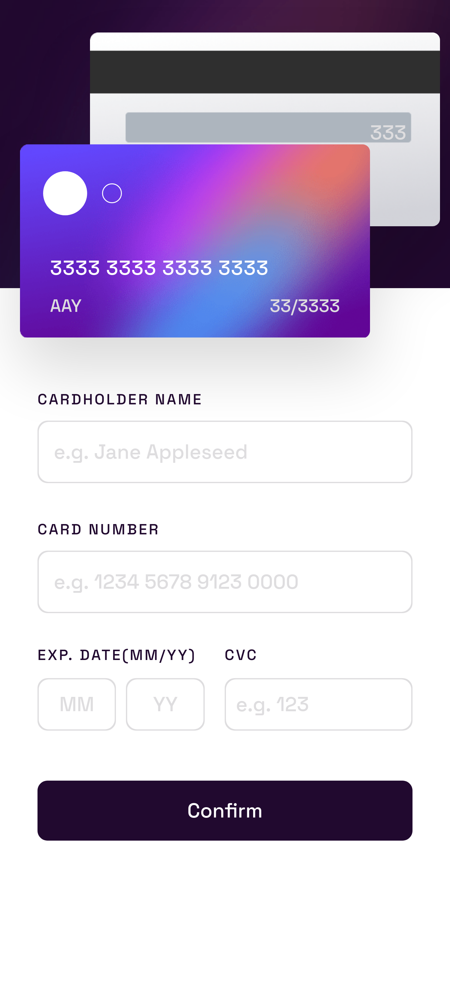

# Frontend Mentor - Interactive card details form solution

This is a solution to the [Interactive card details form challenge on Frontend Mentor](https://www.frontendmentor.io/challenges/interactive-card-details-form-XpS8cKZDWw). Frontend Mentor challenges help you improve your coding skills by building realistic projects.

## Table of contents

- [Overview](#overview)
  - [The challenge](#the-challenge)
  - [Screenshot](#screenshot)
  - [Links](#links)
  - [Built with](#built-with)
  - [What I learned](#what-i-learned)
  - [Continued development](#continued-development)
  - [Useful resources](#useful-resources)
- [Author](#author)

## Overview

    An interactive frontend challenge from frontendmentor using javascript

### The challenge

Users should be able to:

- Fill in the form and see the card details update in real-time
- Receive error messages when the form is submitted if:
  - Any input field is empty
  - The card number, expiry date, or CVC fields are in the wrong format
- View the optimal layout depending on their device's screen size
- See hover, active, and focus states for interactive elements on the page

### Screenshot





### Links

- Solution URL: https://github.com/iceTmZz/interactive-card-details
- Live Site URL: https://icetmzz.github.io/interactive-card-details/

### Built with

- Semantic HTML5 markup
- CSS custom properties
- Flexbox
- Mobile-first workflow -[Tailwind] (https://tailwindcss.com) - css framework
- Vanilla javascript

### What I learned

I learned how to have a card like format with spaces after each 4 digits with the help of Regular expression and 'keyup' event to trigger the regex

```js
cardNumber.addEventListener("keyup", function () {
  const valueInput = this.value.replaceAll(" ", "")
  if (this.value.length > 14) {
    this.value = valueInput.replace(/(\w{4})(\w{4})(\w{4})/, "$1 $2 $3 ")
    cardNumberDisplay.innerHTML = this.value
  } else if (this.value.length > 9) {
    this.value = valueInput.replace(/(\w{4})(\w{4})/, "$1 $2 ")
    cardNumberDisplay.innerHTML = this.value
  } else if (this.value.length > 4) {
    this.value = valueInput.replace(/(\w{4})/, "$1 ")
    cardNumberDisplay.innerHTML = this.value
  } else if (this.value.length <= 4 && this.value.length != 0) {
    cardNumberDisplay.innerHTML = this.value
  } else {
    cardNumberDisplay.innerHTML = "0000 0000 0000 0000"
  }
})
```

### Continued development

    I think i have to focus more on writing cleaner code for javascript

### Useful resources

- [Stack Overflow](https://stackoverflow.com/) - If i ever got stuck on any problem stack overflow is always helpful
- [MDN](https://developer.mozilla.org/) - This website is most helpful website for web developers, it gives reference on every topics of web development

## Author

- Website - [Aayush Tamang](https://aayush-portfolio.vercel.app/)
- Frontend Mentor - [@iceTmZz](https://www.frontendmentor.io/profile/iceTmZz)
- Twitter - [@iceTmZz](https://www.twitter.com/iceTmZz)
